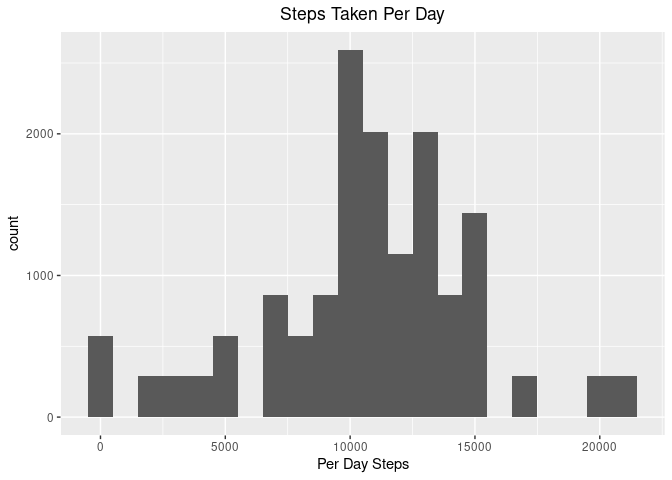
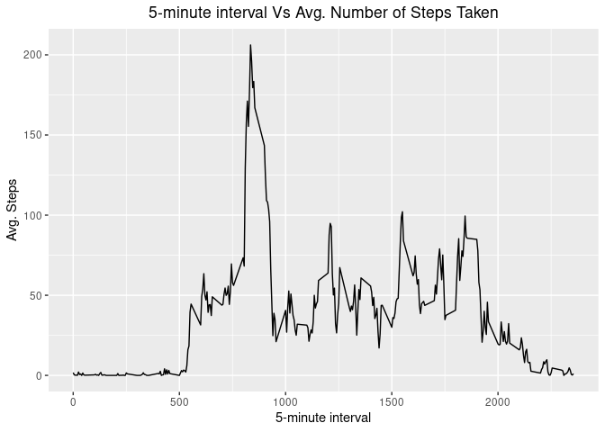
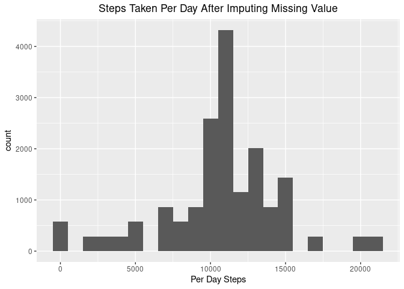

## Loading and preprocessing the data

```r
data <- read.csv("activity.csv")
head(data)
```

```
##   steps       date interval
## 1    NA 2012-10-01        0
## 2    NA 2012-10-01        5
## 3    NA 2012-10-01       10
## 4    NA 2012-10-01       15
## 5    NA 2012-10-01       20
## 6    NA 2012-10-01       25
```


## What is mean total number of steps taken per day?

### 1. Calculate the total number of steps taken per day


```r
library(dplyr)
data_steps_taken_perday <- data %>%
        filter(!is.na(steps)) %>%
        group_by(date) %>%
        summarize(PerDaySteps = sum(steps), steps = steps)

data_steps_taken_perday        
```

```
## # A tibble: 15,264 x 3
## # Groups:   date [53]
##    date       PerDaySteps steps
##    <fct>            <int> <int>
##  1 2012-10-02         126     0
##  2 2012-10-02         126     0
##  3 2012-10-02         126     0
##  4 2012-10-02         126     0
##  5 2012-10-02         126     0
##  6 2012-10-02         126     0
##  7 2012-10-02         126     0
##  8 2012-10-02         126     0
##  9 2012-10-02         126     0
## 10 2012-10-02         126     0
## # … with 15,254 more rows
```

### 2. Histogram for steps taken per day


```r
library(ggplot2)
ggplot(data_steps_taken_perday, aes(x = PerDaySteps)) + 
  geom_histogram(binwidth = 1000) + 
  xlab("Per Day Steps") +
  ggtitle("Steps Taken Per Day") +
  theme(plot.title = element_text(hjust = 0.5))
```

<!-- -->

### 3. Calculate and report the mean and median of the total number of steps taken per day


```r
data %>%
        filter(!is.na(steps)) %>%
        group_by(date) %>%
        summarize(mean = mean(steps, na.rm = TRUE), 
                  median = median(steps, na.rm = TRUE), 
                  total_steps = sum(steps, na.rm = TRUE))
```

```
## # A tibble: 53 x 4
##    date         mean median total_steps
##    <fct>       <dbl>  <dbl>       <int>
##  1 2012-10-02  0.438      0         126
##  2 2012-10-03 39.4        0       11352
##  3 2012-10-04 42.1        0       12116
##  4 2012-10-05 46.2        0       13294
##  5 2012-10-06 53.5        0       15420
##  6 2012-10-07 38.2        0       11015
##  7 2012-10-09 44.5        0       12811
##  8 2012-10-10 34.4        0        9900
##  9 2012-10-11 35.8        0       10304
## 10 2012-10-12 60.4        0       17382
## # … with 43 more rows
```


## What is the average daily activity pattern?

### 1. Make a time series plot (i.e. type = "l"|}type = "l") of the 5-minute interval (x-axis) and the average number of steps taken, averaged across all days (y-axis)


```r
data_daily_activity_pattern <- data %>%
        filter(!is.na(steps)) %>%
        group_by(interval) %>%
        summarize(mean = mean(steps, na.rm = TRUE))

ggplot(data_daily_activity_pattern, aes(x = interval, y = mean)) + geom_line()+
  xlab("5-minute interval") +
  ylab("Avg. Steps") +
  ggtitle("5-minute interval Vs Avg. Number of Steps Taken") +
  theme(plot.title = element_text(hjust = 0.5))
```

<!-- -->

### 2. Which 5-minute interval, on average across all the days in the dataset, contains the maximum number of steps?


```r
data_daily_activity_pattern %>%
  filter(mean == max(mean))
```

```
## # A tibble: 1 x 2
##   interval  mean
##      <int> <dbl>
## 1      835  206.
```

## Imputing missing values

### 1. Report of missing values


```r
data %>%
  summarize(total = n(), na = sum(is.na(steps)), na_percent = (na / total) * 100)
```

```
##   total   na na_percent
## 1 17568 2304   13.11475
```

### 2. impute missing values
We will use mean to impute the missing values.


```r
data_after_impute <- data %>%
  mutate(steps = replace(steps, is.na(steps), mean(steps, na.rm = TRUE)))

head(data_after_impute)
```

```
##     steps       date interval
## 1 37.3826 2012-10-01        0
## 2 37.3826 2012-10-01        5
## 3 37.3826 2012-10-01       10
## 4 37.3826 2012-10-01       15
## 5 37.3826 2012-10-01       20
## 6 37.3826 2012-10-01       25
```

Histogram with the new data set after imputing missing values.


```r
data_after_impute_hist <- data_after_impute %>%
        group_by(date) %>%
        summarize(PerDaySteps = sum(steps), steps = steps)

ggplot(data_after_impute_hist, aes(x = PerDaySteps)) + geom_histogram(binwidth = 1000) + 
  xlab("Per Day Steps") + 
  ggtitle("Steps Taken Per Day After Imputing Missing Value") +
  theme(plot.title = element_text(hjust = 0.5))
```

<!-- -->

Observation: After impute the missing values we can see from the histogram that total count of steps per day has increased significantly.

Report mean, median & total number of steps taken per day


```r
data_after_impute %>%
        group_by(date) %>%
        summarize(mean = mean(steps, na.rm = TRUE), 
                  median = median(steps, na.rm = TRUE), 
                  total_steps = sum(steps))
```

```
## # A tibble: 61 x 4
##    date         mean median total_steps
##    <fct>       <dbl>  <dbl>       <dbl>
##  1 2012-10-01 37.4     37.4      10766.
##  2 2012-10-02  0.438    0          126 
##  3 2012-10-03 39.4      0        11352 
##  4 2012-10-04 42.1      0        12116 
##  5 2012-10-05 46.2      0        13294 
##  6 2012-10-06 53.5      0        15420 
##  7 2012-10-07 38.2      0        11015 
##  8 2012-10-08 37.4     37.4      10766.
##  9 2012-10-09 44.5      0        12811 
## 10 2012-10-10 34.4      0         9900 
## # … with 51 more rows
```

Observation: After impute the missing values mean, median & total steps increase.

## Are there differences in activity patterns between weekdays and weekends?

### 1. Apply weekend and weekday factor


```r
library(lubridate)
data_with_factor <- data_after_impute %>%
  mutate(weekday_weekend = 
           factor(ifelse(wday(as_date(date)) %in% c(1,7), "weekend", "weekday")))
head(data_with_factor)
```

```
##     steps       date interval weekday_weekend
## 1 37.3826 2012-10-01        0         weekday
## 2 37.3826 2012-10-01        5         weekday
## 3 37.3826 2012-10-01       10         weekday
## 4 37.3826 2012-10-01       15         weekday
## 5 37.3826 2012-10-01       20         weekday
## 6 37.3826 2012-10-01       25         weekday
```

### 2. Panel plot by factor


```r
data_factorized <- data_with_factor %>%
  group_by(interval) %>%
  summarize(avg_step_perday = mean(steps), weekday_weekend)

plot <- ggplot(data_factorized, aes(x = interval, y = avg_step_perday)) + 
  geom_line() + 
  facet_grid(row = vars(weekday_weekend)) +
  xlab("5-minute interval") + 
  ylab("Avg. Steps") +
  ggtitle("5-minute interval Vs Steps Taken Per Day") +
  theme(plot.title = element_text(hjust = 0.5))

png(file = "instructions_fig/weekday_weekend_comparison.png")
print(plot)
dev.off()
```

```
## png 
##   2
```

